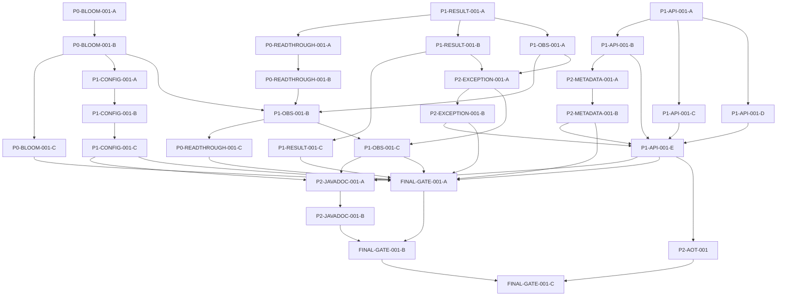

# ResiCache 成熟框架问题收敛任务方案

## 1. 执行摘要

当前 `main@98856ab` 已完成框架硬化与 Phase 4 内部化，当前验证为 916 tests、0 failures/errors/skipped，JaCoCo 阈值与 Checkstyle 均通过。现阶段的主要差距已从“基础实现错误”转为“极端故障正确性、Interface 不变量、公开面收敛、启动期校验和失败可观测性”。

核验结果：核心问题与 Phase 4 公开面收敛均已闭合；AOT/native 与发布保持非阻塞/排除。

`P0-BLOOM-001 → P1-CONFIG-001 → P0-READTHROUGH-001 → P1-RESULT-001 → P1-OBS-001 → P2-EXCEPTION-001 → P1-API-001 → P2-METADATA-001 → P2-JAVADOC-001 → FINAL-GATE-001`

核心决策如下：

- Bloom：普通缓存 CLEAN 不改变“数据源可能存在”集合，因此不再清空 Bloom；删除 rebuilding marker/window，而不是继续修补其分布式时序。
- Read-through：选择可用性优先。loader 成功值必须返回；写回失败只影响缓存并通过统一失败指标暴露，显式 PUT/PUT_IF_ABSENT/CLEAN 继续 fail-fast。
- CacheResult：保留一个不可变 `final` 值类型，以受控工厂和嵌套枚举表达合法状态；删除 Lombok `@Data/@Builder`、setter 和无诊断 failure 工厂。
- Public Interface：仅保留用户注解、框架入口、四个真实扩展 Seam 及其最小传递值类型；内部化 Loader/metadata/默认 Adapter/编排实现，并建立公开面 allowlist Gate。
- Observability：用一个内部 FailureReporter 单点记录低基数 failure counter；WARN/ERROR、异常 message 和 metric tag 默认不含原始 key。

主要风险是 Bloom 语义改变、read-through 可用性行为改变、`CacheResult` 全调用点迁移、跨包内部化和失败指标重复计数。计划以纵向契约测试、小提交和每阶段 Gate 控制风险。Maven Central、同线二进制兼容、旧消费者迁移、native-image 和正式发布准备不属于完成标准。

## 2. 仓库基线

- 分支：`main`
- HEAD：`98856ab2442393a4d25281c392cc59d5e39cad52`（短哈希 `98856ab`）
- 上游：`origin/main@ebaca81`；本地包含后续 3 个提交。
- 工作区：保留用户既有未提交改动；本轮未提交、未推送。
- Java：21；本机验证 JDK 为 Temurin 21.0.12.1。
- Spring Boot：4.0.0；Spring Data Redis 4.0；Spring Framework 7。
- Redis：7.x；Redisson：3.50.0；Caffeine：3.1.8；Maven Wrapper：3.3.4 / Maven 3.9.6。
- 当前源规模：147 个主 Java 文件；编译后 public 顶层类型精确收敛为 allowlist 的 34 个。
- 内部实现已收拢至 package-private `cache` 模块；稳定接口仅保留 allowlist 与文档声明的扩展面。
- 当前测试：2026-09-05 在本 HEAD 实际运行 JDK21 `./mvnw clean test -B`，退出码 0；916 tests，0 failures/errors/skipped；JaCoCo Gate 通过。
- Checkstyle：实际运行 `./mvnw checkstyle:check -B`，退出码 0，0 violations。
- 静态 Gate：`check-test-names.sh`、`check-docs-contracts.sh`、`git diff --check` 均退出 0。
- 工作树独立验证（2026-09-05，未提交状态）：`./mvnw clean verify -B` exit 0（916 tests，0 failures/errors/skipped，JaCoCo 阈值通过）；`./mvnw checkstyle:check -B` exit 0；`./mvnw javadoc:javadoc -B` 0 warnings；`check-docs-contracts.sh`、`check-test-names.sh`、`git diff --check` 均 exit 0。此验证针对当前未提交工作树，不改变“改动保留、不提交不推送”的 guardrail。
- Javadoc：`./mvnw javadoc:javadoc -B` 退出码 0，warning 计数为 0。
- AOT：已有 `spring-boot:process-aot` 只启动 `SerializationMigrationCli` 的证据；它不是宿主自动配置 smoke。AOT/native 均为非阻塞债务。

不属于完成标准：发布、Maven Central、同线二进制兼容、旧消费者迁移、native-image、GraalVM 完整兼容、发布签名和仓库元数据。

## 3. 审查结论核验矩阵

| ID | 原始问题 | 核验状态 | 当前证据 | 影响 | 对应任务 |
|---|---|---|---|---|---|
| BASE-FAILFAST | FAIL_FAST 实际不抛出 | Already Addressed | `RedisProCacheWriter.requireSuccessful` 统一将 PUT/PIFA/CLEAN failure 转为 `CacheOperationException`；故障测试已锁定 | 本轮只做回归 | FINAL-GATE-001-A |
| BASE-SEAM | 默认 Adapter 无法按类型替换 | Already Addressed | `RedisProCacheConfiguration:104-176` 使用 typed `@ConditionalOnMissingBean` | 本轮不得回归 | FINAL-GATE-001-A |
| BASE-SCAN | 根包 `@ComponentScan` | Already Addressed | `RedisProCacheConfiguration:74-101` 为显式 `@Import` | 本轮不得回归 | FINAL-GATE-001-A |
| BASE-IT | `*IT` 未进入 Gate | Already Addressed | `check-test-names.sh` 通过，所有集成测试为 `*IntegrationTest` | 本轮不得回归 | FINAL-GATE-001-B |
| P0-1 | Bloom CLEAN 后可能 fail-closed | Closed | CLEAN 不再触达 Bloom；rebuild marker/window 已删除并由回归测试锁定 | 可能阻止 loader 的 false-negative 已消除 | P0-BLOOM-001 |
| P0-2 | Read-through 写回失败契约未闭合 | Closed | default/sync 两路径均返回 loader 成功值；写回失败进入内部 outcome 与诊断指标 | loader 成功值不再被缓存写失败覆盖 | P0-READTHROUGH-001 |
| P1-1 | CacheResult 可构造非法状态 | Confirmed | `CacheResult:25-114` 使用 `@Data/@Builder` 和 String outcome/operation/kind | 稳定 SPI 值类型不变量泄漏给调用者 | P1-RESULT-001 |
| P1-2 | Public Interface 面过宽 | Closed | 编译后 public 顶层类型与 allowlist 精确相等（34 个）；实现已收拢至 package-private cache 模块 | 文档与 Java 可见性一致 | P1-API-001 |
| P1-3 | 配置校验覆盖不足 | Confirmed | `RedisProCacheProperties:38-290` 只有 root `@Validated`、defaultTtl `@NotNull` 和 Redisson 局部 `@Min`；无嵌套 `@Valid`，线程池/port/database/sync/Bloom 值缺约束 | 非法配置延迟到运行时失败 | P1-CONFIG-001 |
| P1-4 | 失败可观测性依赖日志 | Confirmed | `RedisProCacheMetricsRegistry:50-83` 只有 hit/miss/put/evict/timer；CacheErrorHandler/Bloom 错误没有统一 failure counter | 降级和 best-effort 难运营 | P1-OBS-001 |
| P2-1 | AOT smoke 启动 CLI 而非宿主自动配置 | Confirmed | 实际 process-aot 日志启动 `SerializationMigrationCli`；无 RuntimeHints | 现有 AOT 结论范围窄 | P2-AOT-001 |
| P2-2 | 36 个 Javadoc warning | Closed | JDK21 `javadoc:javadoc` 输出 0 warnings | 公共文档断链已清除 | P2-JAVADOC-001 |
| P2-3 | 失效 Javadoc 引用 | Confirmed | `CacheOperationResolver:18-40` 等引用 private/不可解析成员 | 文档不可导航 | P2-JAVADOC-001 |
| P2-4 | MethodMetadataResolver 定位矛盾 | Closed | resolver/snapshot/activation 与消费者均为内部 cache 协作者；capture/restore/MDC 测试保持通过 | Seam 意图明确且外部面收敛 | P2-METADATA-001 |
| P2-5 | CacheOperationException 不可由外部捕获 | Closed | public final exception 保留 package-private constructor，外部契约可读取 operation/kind/cause 且无 raw key | 调用者可安全分类写失败 | P2-EXCEPTION-001 |
| P2-6 | native-image 未验证 | Out of Scope | 用户明确无发布/native 要求 | 不阻塞本轮 | deferred |

同根新增发现：`ChainObserver` 虽列为稳定 Seam，但 `CacheHandlerChainFactory:195-210` 只手工注册 4 个标准 Adapter，未注入用户 `List<ChainObserver>`；`CacheContext.getCacheOperation()` 又把内部 `RedisCacheableOperation` 泄漏到稳定 Seam。二者均纳入 P1-API-001，不改变关键路径主题。

## 4. 架构决策

### ADR-01 Bloom CLEAN 与 rebuilding 故障契约

- 背景：当前把 Bloom 当作缓存成员索引，CLEAN 后清空并依赖短 TTL marker 补偿；marker 禁用、过期或失败会产生 false-negative。
- 决策：Bloom 表示“数据源可能存在”，普通缓存 CLEAN 只清缓存，不清 Bloom。删除 CLEAN→Bloom clear 后置路径、`BloomRebuilder`、`rebuild-window-seconds` 和 marker 存储。
- 依据：保留旧 Bloom 位最多产生安全的 false-positive；清空则会产生不安全 false-negative。删除时序状态比延长窗口更可靠。
- 用户可观察行为：CLEAN 后首个 GET 一定可越过 Bloom、查询 Redis miss 并调用 loader；多实例无需协调 marker。
- 放弃方案：禁止 0 但继续 TTL marker（TTL 仍可早到期）；marker 读失败返回 true（写失败/多实例仍脆弱）；永久 fail-open window（失去 Bloom 价值且需要完成信号）。
- 后果：缓存 CLEAN 不再重置 Bloom；若将来需要重建数据源存在集合，应提供独立的显式管理操作，不复用缓存清理。
- 测试锁定：CLEAN→GET→loader、并发 CLEAN/GET、多实例共享 Redis、marker 不再访问的架构测试。

### ADR-02 Read-through 写回失败契约

- 背景：GET、loader、write-back 属于一个用户调用；当前 write-back failure 可覆盖已成功 loader 值。
- 决策：选择可用性优先。loader 成功值立即成为 read-through 结果；缓存写回失败被记录但不覆盖结果。显式 PUT/PIFA/CLEAN 仍 fail-fast，REMOVE 仍 observable best-effort。
- 依据：缓存是派生加速层；项目已选择 GET failure→miss；让缓存写失败破坏正确业务值与既有取舍相反。
- 用户可观察行为：cache read failure + loader success + write-back failure 仍返回 loader 值；loader failure 始终抛 `Cache.ValueRetrievalException`；null loader 值按 null policy 返回并尝试写回。
- 放弃方案：一致性优先（缓存不是事实源，代价是无必要降低可用性）；新增策略枚举/配置（增加双倍行为与测试面，无真实需求）。
- 后果：read-through 写失败只通过 failure metric、安全日志和 observer 状态暴露；显式写契约不变。
- 测试锁定：default 与 sync 两路径、Redis-down、timeout、null、loader failure、双故障优先级。

### ADR-03 CacheResult 合法状态模型

- 背景：`@Data/@Builder` 与 String 状态允许矛盾组合。
- 决策：保留一个 `final`、不可变、私有构造的 `CacheResult`；使用嵌套 `Outcome` 与 `FailureKind` enum、typed `CacheOperation`、静态工厂；`isSuccess` 派生；字节数组防御性复制。
- 依据：这是最小改动且能 make illegal states unrepresentable，无需扩张为多个顶层 sealed 类型。
- 用户可观察行为：扩展 Adapter 只能通过 `success/hit/miss/inserted/existing/failure` 工厂创建结果；failure 必须携带 operation、kind、cause。
- 放弃方案：sealed hierarchy（类型数和迁移面更大）；保留 builder 加 validate（非法状态仍可暂存并增加运行时错误）。
- 后果：删除 setter、builder、String 比较和无参数 failure；测试/调用点一次性迁移。
- 测试锁定：反射确认不可变、非法工厂输入拒绝、外部 Adapter 编译契约、byte[] 防御复制。

### ADR-04 Public Interface 与内部类型

- 背景：初始 122 个 public 顶层类型，文档 unstable 不能替代编译可见性；部分公共类型只因跨包或测试方便存在。
- 决策：稳定 public 仅包含：四个注解及其注解属性枚举；`RedisProCache`/`CacheMetrics` 的程序化读面；自动配置入口和 properties；`CacheHandler`、`ChainObserver`、`BloomIFilter`、`LockManager/LockHandle`、`HandlerPriority`；以及这些 Seam 必需的最小不可变值类型。其余归为 internal。
- 依据：四个 Seam 均有多个生产/测试 Adapter 或明确外部替换价值；Loader/metadata/default policy/assembly 类型没有外部证据。
- 用户可观察行为：扩展方从稳定值视图读取 operation/policy/result，不再依赖 Spring `RedisCacheableOperation`、builder 或内部 loader callback。
- 放弃方案：仅在 STABILITY 标记 unstable（无法阻止依赖）；JPMS exports（会增加 Spring 反射/构建复杂度）；保留所有 public 到发布（项目无发布兼容约束）。
- 后果：移动或降可见性；新增一个编译后 public-surface allowlist Gate。`ChainObserver` 改为自动发现有序 Bean，成为真实 Seam。
- 测试锁定：外部包实现四个 Seam；内部类型不可从外部 fixture 导入；allowlist 精确比较。

目标分类：

- 稳定用户面：`RedisCacheable`、`RedisCachePut`、`RedisCacheEvict`、`RedisCaching`、`EarlyExpirationMode`、`RedisProCache`、`CacheMetrics`、`RedisProCacheProperties`、自动配置入口。
- 稳定扩展面：`CacheHandler`、`ChainObserver`、`BloomIFilter`、`LockManager`、`LockHandle`、`HandlerPriority`、`CacheContext`（只读输入+受控 decision 写入）、`HandlerResult`、`CacheResult`、`CacheOperation`、`FlowControl`、`HandlerOrder` 与 decision records。
- 操作员面：`SerializationMigrationCli`、`SerializationMigrationPhase`、`SerializationMigrationProperties`、`SerializationMigrationReport`、`SerializationException`。
- 待内部化：全部 annotation handler、cache writer/manager/interceptor/loader、chain engine/factory/observer implementations、operation builders/register/projector、config implementation classes、默认 protection Adapter/support/executor、serialization implementation/engine。
- 待删除的假 Seam：`TtlPolicy`、`EarlyExpirationPolicy`；`NullValuePolicy` 先经 P1-API-001-D 深化 null codec 后删除；`BloomHashStrategy` 作为内部实现策略保留但不属于公开扩展面；`MethodMetadataResolver` 按 ADR-08 内部化。

### ADR-05 配置校验模型

- 背景：绑定类只有局部约束，嵌套与跨字段关系未形成启动 Gate；Bloom 实现参数还通过 `@Value` 绕过统一模型。
- 决策：所有 nested properties 加 `@Valid/@NotNull`；数值使用 Jakarta 字段约束；线程池、Redis mode/sentinel/TLS 等跨字段关系用类级 validator，并把 violation 绑定到具体 property node；`resi-cache.bloom.*` 合并进 properties。
- 依据：调用者只应学习配置 Interface，非法状态必须在绑定完成时一次失败。
- 用户可观察行为：应用启动失败信息包含完整属性路径和值域原因；默认配置通过。
- 放弃方案：在 Bean factory 手工 `Assert`（错误晚、路径差）；只依赖下游构造器（异常不属于配置 Interface）。
- 后果：删除 raw `@Value`；可能将 Redis mode String 改为 enum；默认值不变，Bloom window 因 ADR-01 删除。
- 测试锁定：ApplicationContextRunner 合法/非法边界、多个错误、跨字段、默认启动。

### ADR-06 Failure metrics 与 key 隐私

- 背景：失败散在 CacheErrorHandler、Bloom 和 read-through，当前主要靠日志；WARN/ERROR 与 exception message 含 raw key。
- 决策：新增内部 final `CacheFailureReporter`（不是 Interface），唯一指标 `resicache.cache.failure`，tag 仅 `operation`、`kind`、`strategy`；标签值来自 enum。Reporter 单点负责指标和安全日志。
- 依据：三个以上调用点共享同一概念，删除 Reporter 会使分类/去重/隐私逻辑重新散落，具备 Depth 与 Locality。
- 用户可观察行为：GET degrade、REMOVE best-effort、read-through write-back failure 可按有限标签告警；默认 WARN/ERROR 和异常不含 raw key。
- 放弃方案：每层自行计数（重复）；cacheName/key/message tag（高基数）；新增 raw-key 配置（安全敏感且无需求）。
- 后果：现有 DEBUG/TRACE 可在用户显式提高日志级别时保留开发诊断；WARN/ERROR 依赖 MDC requestId 关联，不打印 raw key。
- 测试锁定：每个失败恰好一次；tag allowlist；MeterRegistry cardinality；日志/异常不含测试 key。

### ADR-07 CacheOperationException 定位

- 背景：项目承诺 typed runtime failure，但类 package-private。
- 决策：将其作为 public final exception，构造器保持 package-private；公开 `CacheOperation`、`CacheResult.FailureKind` 与 cause getter；message 不包含 raw key。
- 依据：显式写失败是用户可观察 Interface，调用者必须能按 operation/kind 分流；不需要抽象基类或异常层级。
- 用户可观察行为：调用者可捕获 `CacheOperationException` 并读取 operation/kind/cause；key 不公开。
- 放弃方案：公开新的异常基类（只有一个实现）；继续暴露 RuntimeException（typed 承诺无用）；公开 raw key getter（隐私风险）。
- 后果：加入 public allowlist 和外部包契约测试；README/COMPATIBILITY 更新。
- 测试锁定：外部 package catch、cause identity、message/key privacy。

### ADR-08 MethodMetadataResolver 定位

- 背景：仅一个生产 Adapter；test Adapter 只用于验证；Interface 还承担 MDC，且文档同时声称可替换和待内部化。
- 决策：它是内部 AOP→writer context propagation Module，不是外部 Seam。内部化 resolver/snapshot/activation/keys；保留 capture-before-submit、LIFO/finally 不变量。通过 package-local runtime configuration 装配，移除用户 back-off 承诺。
- 依据：删除 Interface 后复杂度不会扩散到外部 caller；真正测试面是 `RedisProCache` async Interface。
- 用户可观察行为：无；异步行为和 MDC 恢复保持一致。
- 放弃方案：继续公开（没有真实 Adapter）；把 MDC 另建公共 port（扩张 Seam）；仅文档标 unstable（仍可依赖）。
- 后果：可能移动 `CacheOperationResolver`/loader metadata 到同一内部 package，并增加一个公开但非扩展的 runtime configuration 入口以允许 Spring 装配 package-private Bean。
- 测试锁定：从外部 async cache 行为验证 worker context，不再为自定义 resolver 保留测试。

## 5. 目标架构与契约

目标调用关系：

```text
RedisCacheInterceptor / Spring Cache
  -> RedisProCache
       -> internal ReadThroughCoordinator
            -> cache read (failure => miss + one failure event)
            -> loader (failure => ValueRetrievalException)
            -> cache write-back (failure => one event, return loaded value)
       -> RedisProCacheWriter
            -> CacheHandler chain
                 -> stable CacheContext/HandlerResult/CacheResult values
                 -> ActualCacheHandler
  -> internal CacheFailureReporter
       -> bounded Micrometer counter
       -> redacted WARN/ERROR
```

- Bloom CLEAN：不清 Bloom，不使用 marker/window/TTL；保留正位仅产生 false-positive。
- Read-through：loader 成功决定业务成功；write-back failure 不覆盖值；显式写继续 fail-fast。
- CacheResult：immutable、typed、factory-only、defensive-copy。
- Public Interface：四个真实 Seam + 最小传递值；ChainObserver 由有序 Bean 自动发现。
- 配置：统一 `RedisProCacheProperties`、启动期 cascade/cross-field validation、精确路径。
- Failure metrics：`resicache.cache.failure{operation,kind,strategy}`；无 cacheName/key/message tag。
- Key 隐私：WARN/ERROR/exception 默认无 raw key；使用 MDC requestId 关联。
- Typed exception：public final 单类型，无多余层级。

## 6. 分阶段任务清单

以下任务状态已按本轮实际实现与验证结果更新；AOT/native 与发布仍按范围明确延期或排除。

### `P0-BLOOM-001` Bloom CLEAN 正确性闭合

- 优先级：P0；阶段：Phase 1；状态：done；工作量：L；阻塞性：是。
- 问题：缓存 CLEAN 清空 Bloom，把安全性绑定到可失败/过期 marker。
- 当前证据：`BloomFilterHandler:96-123`、`BloomSupport:66-114`、`BloomRebuilder:83-127`、`RedisProCacheProperties:170-192`。
- 目标契约：普通 CLEAN 不改变 Bloom；任何 marker/Redis 故障都不能产生 false-negative。
- 设计约束：删除优先，不新增重建状态机；多实例无需协调；显式数据集 rebuild 不在本轮。
- 预计涉及范围：`protection/bloom`、`CacheOperation`、auto-config、properties、metadata、Bloom unit/integration tests、README/ADR。
- 实施步骤：按 A→B→C 完成。
- 测试任务：CLEAN→GET→loader、并发、多实例、无 marker I/O。
- 文档任务：删除 window/marker 配置与旧时序说明。
- 前置依赖：无；后续依赖：P1-CONFIG-001-A、P1-OBS-001-B、FINAL-GATE-001-A。
- 风险：误删真正的数据集 rebuild 能力；回滚或降级：单独回滚 B/C，但不得恢复 CLEAN clear。
- 验收标准：生产调用链中 CLEAN 不可到达 `BloomIFilter.clear`；全部 Bloom/集成测试通过。
- 验证命令：`./mvnw -Dtest=BloomRebuilderTest,BloomSupportTest,BloomFilterIntegrationTest,RedisCacheSemanticsIntegrationTest test -B`。
- 建议提交边界：一个 `fix(bloom)` 提交；父任务由三个子任务组成。

#### `P0-BLOOM-001-A` 移除 CLEAN→Bloom clear 耦合

- 优先级/阶段/状态/工作量/阻塞性：P0 / Phase 1 / done / M / 是。
- 问题与证据：`BloomFilterHandler.afterChainExecution` 的 CLEAN 分支调用 `clearBloomFilter`。
- 目标契约：PUT/PIFA 继续 add；CLEAN 不触碰 Bloom。
- 预计文件：`BloomFilterHandler.java`、`CacheOperation.java`、对应测试。
- 实施步骤：修改 post-process operation 集合；删除 CLEAN 分支/私有 clear wrapper；更新单元测试为“不调用 clear”。
- 测试：handler CLEAN 成功/失败/skip 场景；PUT/PIFA 回归。
- 文档：本子任务不改用户文档。
- 依赖/后续：无；后续 P0-BLOOM-001-B/C。
- 风险/回滚：风险为误伤 PUT 回填；回滚仅限 PUT/PIFA 部分。
- 验收标准：图谱/grep 无生产 CLEAN→BloomSupport.clear 路径。
- 验证命令：`./mvnw -Dtest=BloomFilterHandlerTest,CacheOperationTest test -B`。
- 建议提交边界：独立行为提交。

#### `P0-BLOOM-001-B` 删除 rebuilding marker/window

- 优先级/阶段/状态/工作量/阻塞性：P0 / Phase 1 / done / M / 是。
- 问题与证据：marker window 的 0、读失败、写失败、TTL 到期均不能给出正确性保证。
- 目标契约：CLEAN 正确性不依赖时间或 Redis marker。
- 预计文件：删除 `BloomRebuilder.java`；收缩 `BloomSupport`、`RedisProCacheConfiguration`、`RedisProCacheProperties`、additional metadata 与相关 tests。
- 实施步骤：移除 rebuilder field/bean/property/metadata；删除 marker tests；保留 Bloom operation 异常 fail-open。
- 测试：BloomSupport 正常/底层异常；配置 metadata 不再含 window。
- 文档：由 C 统一更新。
- 依赖/后续：依赖 A；后续 C、P1-CONFIG-001-A、P1-OBS-001-B。
- 风险/回滚：误删未来 admin rebuild；如需要另立候选债务，不恢复 CLEAN marker。
- 验收标准：无 `BloomRebuilder`、`rebuild-window-seconds`、rebuild key。
- 验证命令：`rg -n 'BloomRebuilder|rebuild-window-seconds|rebuildKey' src/main src/test README*` 应只命中迁移说明或零命中；运行 Bloom 单测。
- 建议提交边界：删除型独立提交。

#### `P0-BLOOM-001-C` 锁定 CLEAN 并发/多实例契约

- 优先级/阶段/状态/工作量/阻塞性：P0 / Phase 1 / done / M / 是。
- 问题：必须证明删除 marker 后 loader 永不被空 Bloom 阻断。
- 目标契约：CLEAN 后立即/并发 GET 必须调用 loader；多实例行为只允许 false-positive。
- 预计文件：`BloomFilterIntegrationTest`、`RedisCacheSemanticsIntegrationTest`、必要 fault fixture、README/ADR。
- 实施步骤：增加 CLEAN→GET、CLEAN/GET race、两个 context 共享 Redis 的测试；断言无 marker I/O；更新文档。
- 测试：包含原要求的 marker 读/写失败与 TTL 场景，改为架构性“不存在 marker 依赖”的断言。
- 依赖/后续：依赖 A/B；后续 FINAL-GATE-001-A。
- 风险/回滚：并发测试抖动；用 latch/barrier，不用 sleep。
- 验收标准：测试重复运行稳定，loader 计数精确。
- 验证命令：`./mvnw -Dtest=BloomFilterIntegrationTest,RedisCacheSemanticsIntegrationTest test -B`。
- 建议提交边界：测试+文档提交。

### `P0-READTHROUGH-001` 可用性优先 read-through

- 优先级：P0；阶段：Phase 1；状态：done；工作量：XL；阻塞性：是。
- 问题：loader 与 write-back exception 未分相，成功业务值可能被缓存失败覆盖。
- 当前证据：`RedisProCache:147-211`、`LoaderOrchestrator:122-242`、`RedisDownFaultInjectionIntegrationTest:20-75`。
- 目标契约：loader 成功值总是返回；loader failure 抛出；write-back failure 单次上报；显式写契约不变。
- 设计约束：无新配置/策略枚举；保留 Spring default path 的同步性质；内部 outcome 可扩展但不 public。
- 预计范围：RedisProCache、LoaderOrchestrator/后继 internal coordinator、Writer failure translation、metrics/observer tests/docs。
- 实施步骤：A→B→C。
- 测试：完整 read-through 矩阵。
- 文档：README/COMPATIBILITY/ADR。
- 前置依赖：P1-RESULT-001-A 提供 typed FailureKind；后续 P1-OBS-001-B、P2-EXCEPTION-001、FINAL Gate。
- 风险：破坏 sync single-flight 或 null caching；回滚：按 default/sync 两路径分别回滚，不回滚契约测试。
- 验收标准：Redis-down 时 loader 成功值可见；显式 PUT/CLEAN 仍抛 typed failure。
- 验证命令：targeted RedisProCache/Loader/Sync/RedisDown tests。
- 建议提交边界：行为、接线、集成文档三个提交。

#### `P0-READTHROUGH-001-A` 分离 loader failure 与 write-back failure

- 优先级/阶段/状态/工作量/阻塞性：P0 / Phase 1 / done / M / 是。
- 问题：`performLockedLoad` 一个 catch 同时包住 loader 与 put。
- 目标契约：loader exception 优先并停止；put exception 产生 internal `LoadedWithWriteBackFailure(value,failure)` outcome。
- 文件：LoaderOrchestrator/后继 coordinator、LoaderOrchestratorTest。
- 步骤：分开 try/catch；为 null value 使用显式“已加载”标记；保持锁内 double-check。
- 测试：loader throw、value/null+put throw、double-check hit 不写回。
- 文档：Javadoc contract。
- 依赖/后续：依赖 P1-RESULT-001-A；后续 B、P1-OBS-001-A。
- 风险/回滚：误把 loader exception 当 write-back；测试按 cause identity 锁定。
- 验收标准：outcome 能同时携带值与写回失败，不暴露为 public。
- 验证命令：`./mvnw -Dtest=LoaderOrchestratorTest test -B`。
- 提交边界：内部 outcome 提交。

#### `P0-READTHROUGH-001-B` 接线 default/sync 路径并保留同步语义

- 优先级/阶段/状态/工作量/阻塞性：P0 / Phase 1 / done / L / 是。
- 问题：default path 委派 `super.get(key,loader)`，write-back failure 时难恢复已加载值。
- 目标契约：default 与 sync 均 availability-first；programmatic `Cache.get(key,Callable)` 的本地同步语义保持。
- 文件：RedisProCache、LoaderOrchestrator/内部 helper、RedisProCacheTest、SyncSingleFlight tests。
- 步骤：用内部 value capture 包装 loader，区分“未调用/调用返回 null/调用返回值”；只捕获 write-back typed failure 并返回已捕获值；sync 路径消费 A 的 outcome。
- 测试：hit、miss+success、read fail+load success、write-back fail、双故障、timeout、null、single-flight。
- 文档：本子任务只更新源码 Javadoc。
- 依赖/后续：依赖 A；后续 C、P1-OBS-001-B。
- 风险/回滚：loader 被调用两次；用计数断言和 barrier。
- 验收标准：两路径 loader 恰好一次，返回值不被 write-back 覆盖。
- 验证命令：`./mvnw -Dtest=RedisProCacheTest,LoaderOrchestratorTest,SyncSingleFlightIntegrationTest test -B`。
- 提交边界：read-through 接线提交。

#### `P0-READTHROUGH-001-C` Redis-down 契约与文档

- 优先级/阶段/状态/工作量/阻塞性：P0 / Phase 1 / done / M / 是。
- 问题：现有 Redis-down 只测 Writer，不测用户 read-through Interface。
- 目标契约：用户调用层验证 availability-first 和 failure metric。
- 文件：RedisDownFaultInjectionIntegrationTest、PathCAopContractIntegrationTest、README/COMPATIBILITY/ADR。
- 步骤：增加 cache/annotation read-through failure cases；断言业务值、cause、loader count、metric count；同步中英文文档。
- 测试：所有 Read-through 矩阵行。
- 依赖/后续：依赖 B、P1-OBS-001-B；后续 FINAL Gate。
- 风险/回滚：端口故障模拟只覆盖 connect failure；补 writer mock/timeout 单测。
- 验收标准：文档与两条运行路径一致。
- 验证命令：`./mvnw -Dtest=RedisDownFaultInjectionIntegrationTest,PathCAopContractIntegrationTest test -B`。
- 提交边界：集成测试+文档。

### `P1-RESULT-001` CacheResult 合法状态模型

- 优先级：P1；阶段：Phase 2；状态：done；工作量：L；阻塞性：是。
- 问题/证据：`CacheResult:25-114` 可变且 String 状态。
- 目标契约：ADR-03；预计范围：CacheResult、CacheErrorHandler、Writer、ChainEngine、handlers、observers、tests。
- 实施步骤：A 类型；B 调用点；C 外部契约。
- 测试/文档：非法状态、SPI factory、STABILITY/Javadoc。
- 依赖：无；后续 Readthrough A、OBS A、Exception A、API B、Final。
- 风险：高 fan-in（图谱 132 inbound）；回滚：逐工厂迁移，临时 compatibility adapter 仅限同一提交内。
- 验收标准：无 builder/setter/String outcome comparison。
- 验证命令：`./mvnw -Dtest=CacheResultTest,ChainEngineTest,CacheErrorHandlerTest test -B`。
- 提交边界：类型+迁移+契约最多三个提交。

#### `P1-RESULT-001-A` 建立不可变 typed CacheResult

- 优先级/阶段/状态/工作量/阻塞性：P1 / Phase 2 / done / M / 是。
- 问题：非法状态可表示。
- 目标：private constructor；nested Outcome/FailureKind；typed CacheOperation；factory-only；defensive copy。
- 文件：CacheResult.java、CacheResultTest.java。
- 步骤：删除 Lombok data/builder；定义不变量；删除 no-arg failure；拒绝 null failure metadata。
- 测试：合法状态、非法输入、不可变性、byte[] copy。
- 文档：Javadoc。
- 依赖/后续：无；后续 B、Readthrough A、OBS A。
- 风险/回滚：编译面大；先只提交类型+编译红测试不可单独合并，故与最小调用兼容桥同提交。
- 验收标准：反射无 public setter/constructor/builder。
- 验证命令：`./mvnw -Dtest=CacheResultTest test -B`。
- 提交边界：核心值类型。

#### `P1-RESULT-001-B` 迁移生产调用点

- 优先级/阶段/状态/工作量/阻塞性：P1 / Phase 2 / done / L / 是。
- 问题：132 inbound 依赖旧 getter/String。
- 目标：全部使用 typed access/factory。
- 文件：chain/cache/protection/metrics 相关调用者。
- 步骤：按 factory、reader、observer 三组迁移；删除兼容桥；检查 switch 穷尽性。
- 测试：全量 chain/handler/writer 单测。
- 文档：无独立用户文档。
- 依赖/后续：依赖 A；后续 C、Exception A、API B。
- 风险/回滚：结果语义漂移；保留 golden matrix。
- 验收标准：`rg 'getOutcome\(\).*"|setSuccess|CacheResult.builder'` 零命中。
- 验证命令：相关 targeted tests + compile。
- 提交边界：调用点迁移。

#### `P1-RESULT-001-C` 锁定外部 Adapter 创建契约

- 优先级/阶段/状态/工作量/阻塞性：P1 / Phase 2 / done / S / 是。
- 目标：外部 CacheHandler/ChainObserver 只能创建合法结果。
- 文件：`src/test/java/com/example/extension` fixture、STABILITY。
- 步骤：从外部 package 编译/运行 factories；反射验证不可变。
- 测试：全部 CacheResult matrix。
- 依赖：B；后续 FINAL Gate。
- 风险/回滚：无；验收：fixture 不访问内部 constructor。
- 验证命令：`./mvnw -Dtest=CacheResultTest,PublicExtensionContractTest test -B`。
- 提交边界：契约测试+文档。

### `P1-API-001` Public Interface 收敛

- 优先级：P1；阶段：Phase 2；状态：done；工作量：XL；阻塞性：是。
- 问题（已闭合）：初始 122 public 类型、浅 Loader、ChainObserver 未自动发现、稳定 Context 泄漏内部 operation。
- 目标契约：ADR-04。
- 范围：全主代码 package/visibility、auto-config、external fixtures、STABILITY/CLAUDE。
- 实施：A allowlist；B loader/context；C observer；D provisional strategy；E 文档收口。
- 依赖：Result B；后续 Metadata、Exception、Final。
- 风险：Spring reflection/Bean 装配；回滚：按子任务独立回滚。
- 验收：public allowlist 精确匹配；四 Seam 外部可用。
- 验证：architecture tests + auto-config integration + full verify。
- 提交边界：每子任务独立。

#### `P1-API-001-A` 建立 public-surface manifest 与 Gate

- 优先级/阶段/状态/工作量/阻塞性：P1 / Phase 2 / done / M / 是。
- 目标：编译后反射枚举 public 顶层类型，与审定 allowlist 比较。
- 文件：architecture test、allowlist resource、CI/docs check 接线。
- 步骤：`Class.forName(name,false,loader)` 避免静态初始化；按 stable/operator/entry 分类；新增类型必须显式更新 manifest。
- 测试：当前编译产物 public surface 为 34 个 allowlist 条目；差异输出完整且 exact-match Gate 已通过。
- 依赖：无；后续 B/C/D、Metadata、Exception。
- 风险：nested/synthetic class 误报；过滤 `$` 与 generated classes。
- 验收：Gate 能对新增 public type 变红。
- 验证命令：`./mvnw -Dtest=PublicSurfaceContractTest test -B`。
- 提交边界：Gate 基础设施。

#### `P1-API-001-B` 内部化 Loader 与 operation 泄漏

- 优先级/阶段/状态/工作量/阻塞性：P1 / Phase 2 / done / L / 是。
- 目标：LoaderOrchestrator/LoadOutcome/DefaultLoadFn/CacheOperationResolver 不再 public；CacheContext 不返回内部 RedisCacheableOperation/CacheInput。
- 文件：cache/loader、cache、chain/model、operation、config、tests。
- 步骤：将 loader coordinator 移入 cache internal assembly；为 CacheHandler 暴露最小 immutable policy view；移除 getInput/getCacheOperation 实现类型泄漏；迁移 tests 到 Interface。
- 测试：外部 handler 仍能读取所需 policy；内部类型外部 import 编译失败由 source/manifest Gate 验证。
- 依赖：A、Result B、Readthrough B；后续 E、Metadata。
- 风险：stable SPI 缺字段；先盘点所有 handler 读取项并一次形成 policy view。
- 验收：Loader 生产 caller 不变且类型不在 public manifest。
- 验证命令：cache/chain/annotation integration tests。
- 提交边界：loader/context internalization。

#### `P1-API-001-C` 使 ChainObserver 成为真实 Seam

- 优先级/阶段/状态/工作量/阻塞性：P1 / Phase 2 / done / M / 是。
- 证据：Factory 构造器无 `List<ChainObserver>`，标准 observer 在 `registerStandardObservers` 中 `new`。
- 目标：标准和用户 observer 均为 ordered Bean，由单一装配点注册一次。
- 文件：observer classes、RedisProCacheConfiguration、CacheHandlerChainFactory、ChainEngine、tests。
- 步骤：声明标准 beans；注入 ordered list；固定顺序与去重；删除 manual new；定义注册时机。
- 测试：外部 observer 自动调用、顺序、异常隔离、无重复。
- 依赖：A；后续 E。
- 风险：重复 Timer/MDC；Gate 断言每类一次。
- 验收：用户只需声明 ChainObserver Bean。
- 验证命令：`./mvnw -Dtest=ChainObserverTest,CacheHandlerChainFactoryTest,RedisProCacheConfigurationContractTest test -B`。
- 提交边界：observer seam。

#### `P1-API-001-D` 删除或内部化 provisional strategy

- 优先级/阶段/状态/工作量/阻塞性：P1 / Phase 2 / done / L / 是。
- 目标：删除 TtlPolicy/EarlyExpirationPolicy 假 Seam；深化 null codec 后删除 NullValuePolicy；BloomHashStrategy 仅内部保留；默认 Adapter 不 public。
- 文件：protection 子包、auto-config、tests、CLAUDE/STABILITY。
- 步骤：逐接口执行 deletion test；把纯计算并入唯一消费者；跨包 null 行为收口为内部 codec；删除 typed back-off 承诺。
- 测试：行为不变、默认配置、外部 allowlist。
- 依赖：A；后续 E、Config。
- 风险：过度合并 handler；不合并 BloomIFilter/LockManager 等真实 Seam。
- 验收：provisional strategies 不在 public manifest。
- 验证命令：protection targeted tests + auto-config test。
- 提交边界：按 protection domain 分提交。

#### `P1-API-001-E` 同步 Interface 文档

- 优先级/阶段/状态/工作量/阻塞性：P1 / Phase 4 / done / S / 是。
- 目标：STABILITY/README/CLAUDE/Javadoc 与实际 public manifest 一致。
- 文件：上述文档及 ADR index。
- 步骤：列稳定/操作员/entry/internal；删除 provisional migration 表的已完成项；记录 breaking internalization 不受发布兼容约束。
- 测试：docs contract 增加 manifest pointer。
- 依赖：B/C/D、Metadata B、Exception B；后续 Javadoc、Final。
- 风险：重复真相；public manifest 为唯一机器真相，文档只解释分类。
- 验收：文档无相互矛盾。
- 验证命令：`bash scripts/ci/check-docs-contracts.sh`。
- 提交边界：文档提交。

### `P1-CONFIG-001` 启动期配置校验

- 优先级：P1；阶段：Phase 3；状态：done；工作量：L；阻塞性：是。
- 问题：nested/cross-field/implementation properties 未统一校验。
- 目标：ADR-05；范围：Properties、auto-config、metadata、validators、ApplicationContextRunner tests/docs。
- 实施：A 统一模型；B constraints；C binding tests。
- 依赖：Bloom B、API D；后续 Final。
- 风险：默认值/路径变化；回滚：保持 key，回滚 constraint 单项。
- 验收：非法配置在 context refresh 时失败并带准确路径。
- 验证：ConfigurationProperties/AutoConfiguration contract tests。
- 提交边界：模型、validator、tests/docs。

#### `P1-CONFIG-001-A` 合并 Bloom implementation properties

- 优先级/阶段/状态/工作量/阻塞性：P1 / Phase 3 / done / M / 是。
- 目标：`resi-cache.bloom.*` 从 `@Value` 迁入 nested validated properties；window key 删除。
- 文件：RedisProCacheProperties、RedisProCacheConfiguration、BloomFilterConfig、metadata/docs/tests。
- 步骤：新增 nested fields prefix/bitSize/hashFunctions/hashCacheSize；factory 接收 properties；保留现有 key 名。
- 测试：默认值和绑定值。
- 依赖：Bloom B；后续 B/C。
- 风险：metadata drift；JSON 与 generated metadata 同测。
- 验收：auto-config 无 `@Value("${resi-cache.bloom`。
- 验证：properties/config contract tests。
- 提交边界：配置模型。

#### `P1-CONFIG-001-B` 增加字段和跨字段约束

- 优先级/阶段/状态/工作量/阻塞性：P1 / Phase 3 / done / M / 是。
- 目标：`@Valid/@NotNull` cascade；pool/max/queue、sync timeout、port/database、Bloom sizes、serializer sample、sentinel/TLS mode 约束。
- 文件：Properties、一个类级 validator annotation+implementation（仅跨字段）。
- 步骤：用标准 Jakarta 约束覆盖单字段；类级 validator 精确 addPropertyNode；mode 改 enum 或显式校验。
- 测试：合法最小/非法值/max<core/多错误。
- 依赖：A、API D；后续 C。
- 风险：重复 TlsConfigurationValidator；迁移后删除旧 validator，单一真相。
- 验收：无下游构造器才发现的已知非法配置。
- 验证：unit + context runner。
- 提交边界：validation implementation。

#### `P1-CONFIG-001-C` 启动失败和消息契约

- 优先级/阶段/状态/工作量/阻塞性：P1 / Phase 3 / done / M / 是。
- 目标：真实 auto-config refresh 时错误包含 `resi-cache.<path>` 与原因。
- 文件：RedisProCacheConfigurationContractTest/新 binding test、metadata、README。
- 步骤：参数化 invalid properties；多个错误只要求都可定位、不锁定排序；默认 context green。
- 依赖：B；后续 Final、Javadoc。
- 风险：Spring message 文案版本变化；断言 property path 与 constraint fragment。
- 验收：全部配置矩阵覆盖。
- 验证：targeted context tests + docs script。
- 提交边界：tests/docs。

### `P1-OBS-001` 统一失败可观测性与隐私

- 优先级：P1；阶段：Phase 3；状态：done；工作量：L；阻塞性：是。
- 问题：失败只有日志，无统一 counter，raw key 泄漏。
- 目标：ADR-06；范围：metrics、CacheErrorHandler、Bloom/read-through、exception、observer/log tests/docs。
- 实施：A Reporter；B 接线去重；C privacy。
- 依赖：Result A、Readthrough A、Bloom B；后续 Readthrough C、Exception、Final。
- 风险：重复计数/高基数；回滚：关闭 Reporter Bean 不改变业务语义。
- 验收：每个失败一次、tag allowlist、raw key absent。
- 验证：SimpleMeterRegistry + Logback ListAppender tests。
- 提交边界：metric、integration、privacy。

#### `P1-OBS-001-A` 建立内部 FailureReporter

- 优先级/阶段/状态/工作量/阻塞性：P1 / Phase 3 / done / M / 是。
- 目标：内部 final Module 接收 typed operation/kind/strategy，注册一个 counter。
- 文件：cache/metrics 或 chain/handler internal、auto-config、tests。
- 步骤：定义 bounded enums；null MeterRegistry no-op；不定义 public interface；tag 无 cache/key/message。
- 测试：全部 enum 组合、null registry、tag 集合。
- 依赖：Result A；后续 B、Exception A。
- 风险：kind 与 CacheResult 重复；复用 CacheResult.FailureKind。
- 验收：metric 名唯一且注册幂等。
- 验证：FailureReporterTest。
- 提交边界：reporter Module。

#### `P1-OBS-001-B` 接线且保证一次计数

- 优先级/阶段/状态/工作量/阻塞性：P1 / Phase 3 / done / M / 是。
- 目标：CacheErrorHandler 为 Redis op 单点；read-through 不重复；REMOVE/GET/write-back 可见。
- 文件：CacheErrorHandler、ActualCacheHandler、RedisProCache/Writer、Bloom residual error paths、tests。
- 步骤：定义 ownership table；每个 catch 只调用一个 reporter；observer 不计业务 failure。
- 测试：GET/PUT/PIFA/CLEAN/REMOVE、read-through 双故障、同一异常计数=1。
- 依赖：A、Readthrough B、Bloom B；后续 C、Readthrough C。
- 风险：chain 与 outer caller 双计；用 meter delta 断言。
- 验收：ownership table 与代码一致。
- 验证：error/reader/writer/integration tests。
- 提交边界：接线提交。

#### `P1-OBS-001-C` 删除 raw key 暴露

- 优先级/阶段/状态/工作量/阻塞性：P1 / Phase 3 / done / M / 是。
- 目标：WARN/ERROR、CacheOperationException message/getters、failure metrics 均无 raw key；DEBUG/TRACE 仅通过显式日志级别启用。
- 文件：CacheErrorHandler、CacheOperationException、Bloom/lock error logs、observer tests、README security note。
- 步骤：WARN/ERROR 用 operation/kind/requestId/cacheName；删除 key getter；扫描所有 warn/error 模板。
- 测试：secret sentinel 不出现在日志、exception、tags。
- 依赖：B、Exception A；后续 Final。
- 风险：诊断信息不足；保留 cause 与 MDC requestId。
- 验收：静态脚本与日志测试通过。
- 验证：security/log tests + `rg` review。
- 提交边界：privacy hardening。

### `P2-METADATA-001` 内部化 metadata lifecycle

- 优先级：P2；阶段：Phase 2；状态：done；工作量：L；阻塞性：是（阻塞 public Interface DoD）。
- 问题：定位矛盾且只有一生产 Adapter。
- 目标：ADR-08；范围：metadata、CacheOperationResolver、Writer/Interceptor、runtime config、tests/docs。
- 子任务：A 内部化装配；B 测试/文档迁移。
- 依赖：API A/B；后续 API E、Final。
- 风险：async MDC/ThreadLocal 泄漏；回滚：保留新外部行为测试后回滚 package move。
- 验收：public manifest 无 resolver/snapshot/scope。
- 验证：MethodMetadataResolverTest 替换为 async Interface tests + full verify。
- 提交边界：两提交。

#### `P2-METADATA-001-A` 重组为内部 context propagation Module

- 优先级/阶段/状态/工作量/阻塞性：P2 / Phase 2 / done / L / 是。
- 步骤：将 resolver/snapshot/scope/keys 与消费者放入可 package-private 协作的 cache internal 区；用 package-local Bean/runtime configuration 装配；删除外部 `@ConditionalOnMissingBean`。
- 测试：capture-before-submit、LIFO、worker prior state restore、caller MDC unchanged。
- 依赖：API A/B；后续 B。
- 风险：Spring 无法发现 package-private bean；用 context runner 验证。
- 验收：无 public metadata type。
- 验证：async targeted tests。
- 提交：package/assembly。

#### `P2-METADATA-001-B` 将测试面移到 RedisProCache async Interface

- 优先级/阶段/状态/工作量/阻塞性：P2 / Phase 2 / done / M / 是。
- 步骤：删除自定义 resolver Adapter 测试；通过 `retrieve/store`、AOP integration 观察 worker/caller 状态；同步 CLAUDE/STABILITY/ADR。
- 依赖：A；后续 API E/Final。
- 风险：无法直接观察 worker；使用测试 observer/latch，不暴露生产 hook。
- 验收：内部重构不要求改外部契约测试。
- 验证：PathCAopAsyncIntegrationTest + cache async tests。
- 提交：tests/docs。

### `P2-EXCEPTION-001` Typed write failure Interface

- 优先级：P2；阶段：Phase 3；状态：done；工作量：M；阻塞性：是。
- 目标：ADR-07；子任务 A public typed exception，B external catch/docs。
- 依赖：Result B、OBS A、API A；后续 OBS C、API E、Final。
- 风险：public 面增加 1 个类型但替代模糊 RuntimeException；回滚：不可回到不可捕获 typed 承诺。
- 验收：外部 package 可按 operation/kind/cause 处理且无 raw key。
- 验证：writer failure + external contract tests。
- 提交边界：exception + docs。

#### `P2-EXCEPTION-001-A` 公开最小 final exception

- 优先级/阶段/状态/工作量/阻塞性：P2 / Phase 3 / done / S / 是。
- 步骤：public final class；package-private constructor；typed getters；删除 key field/getter/message；复用 FailureKind。
- 测试：cause identity、operation/kind、privacy。
- 依赖：Result B、OBS A；后续 B/OBS C。
- 验收：无异常层级/工厂抽象。
- 验证：RedisProCacheWriterFailureTest。
- 提交：exception type。

#### `P2-EXCEPTION-001-B` 外部捕获与文档契约

- 优先级/阶段/状态/工作量/阻塞性：P2 / Phase 3 / done / S / 是。
- 步骤：com.example 外部 fixture catch；更新 README/COMPATIBILITY/STABILITY；加入 public allowlist。
- 依赖：A、API A；后续 API E/Final。
- 风险：文档重复；STABILITY 为单一真相。
- 验收：外部 fixture 编译运行。
- 验证：PublicExtensionContractTest + docs script。
- 提交：test/docs。

### `P2-JAVADOC-001` Javadoc 零 warning

- 优先级：P2；阶段：Phase 4；状态：done；工作量：M；阻塞性：是。
- 问题（已闭合）：初始 36 warnings。
- 子任务：A 修复当前引用；B 建立 fail-on-warning Gate。
- 依赖：API E、Config C、OBS C、Metadata B、Exception B；后续 Final。
- 风险：私有成员无法 cross-package link；用 plain code text 代替无意义 link。
- 验收：0 warnings。
- 验证：`./mvnw javadoc:javadoc -B`、`clean verify`。
- 提交：docs then gate。

#### `P2-JAVADOC-001-A` 清除当前 36 warnings

- 优先级/阶段/状态/工作量/阻塞性：P2 / Phase 4 / done / S / 是。
- 步骤：修复/移除不可解析 private/cross-package links；补 import/qualified links；不改变实现。
- 测试：Javadoc goal。
- 依赖：上述文档/内部化任务；后续 B。
- 风险：warning 数因类型删除变化；以最终源码重新计数。
- 验收：日志无 `warning:`。
- 提交：Javadoc cleanup。

#### `P2-JAVADOC-001-B` Javadoc warning Gate

- 优先级/阶段/状态/工作量/阻塞性：P2 / Phase 4 / done / S / 是。
- 步骤：使用现有 Maven Javadoc plugin 的 failOnWarnings/等价标准能力接入 CI docs job；不新增依赖。
- 测试：制造临时验证后撤销，或通过现有 warning baseline 先红后绿。
- 依赖：A；后续 Final。
- 风险：JDK doclint 差异；固定 JDK21。
- 验收：warning 会使 Gate 失败。
- 验证：CI/local javadoc command。
- 提交：build/docs gate。

### `P2-AOT-001` 宿主自动配置 AOT smoke（非阻塞）

- 优先级：P2；阶段：Phase 4；状态：deferred（2026-09-05 实际尝试并记录精确失败证据）；工作量：M；阻塞性：否。
- 问题：当前 process-aot 只启动 migration CLI。
- 目标：用现有 TestApplication 执行 Boot 4 的 test AOT goal（`spring-boot:process-test-aot`），验证自动配置 context；不做 native-image。
- 尝试证据（2026-09-05，JDK Temurin 21.0.12.1）：Boot 4.0.0 无 `test-process-aot` goal，实际 goal 为 `spring-boot:process-test-aot`；执行 exit 1。根因：Spring `TestClassScanner` 要求处理 classpath 上**全部** Spring 测试上下文，而 Testcontainers `@Container` 仅在 JUnit 生命周期内启动，AOT 处理时 `redissonClient` 报 `Mapped port can only be obtained after the container is started`（`AbstractRedisIntegrationTest.lambda$redisProperties$0:78`）。
- 结论：按任务回滚路径保持 DEFERRED（精确错误已记录于 `.agent/tasks/resicache-framework-hardening.yaml` P2-AOT-001/P2-AOT-001-A）；未做任何 native 声明。如未来要收敛，需让集成 fixture 容器可在 AOT JVM 内懒启动或用独立 host-context 测试模块，属新任务范围。
- 范围：测试配置、可选 Maven profile/CI；禁止新 Maven module。
- 步骤：先验证原生 `process-test-aot`；仅在需要时增加最小 profile；记录命令/范围。
- 测试：AOT generation success、自动配置 bean 可解析。
- 文档：ADR/PERFORMANCE 或 CONTRIBUTING 记录准确范围。
- 依赖：API/Config/Metadata 完成；后续 FINAL-GATE-001-C 接受 VERIFIED 或明确 DEFERRED。
- 风险：插件目标不支持测试布局；回滚 profile，保留 truthful deferred。
- 验收：不再用 CLI 启动证明宿主 AOT；无 native claim。
- 验证命令：`./mvnw spring-boot:process-test-aot -B`。
- 提交边界：可选 AOT smoke。

### `FINAL-GATE-001` 完整成熟度 Gate

- 优先级：P0；阶段：Phase 5；状态：done；工作量：L；阻塞性：是。
- 目标：所有 Confirmed/Partially Addressed 项有运行证据，旧 Gate 不回归。
- 子任务：A targeted contract；B full build/static；C doc/task closure。
- 依赖：所有阻塞父任务；AOT 可 VERIFIED 或 DEFERRED。
- 风险：测试数变化/并发抖动；回滚：定位到最后独立提交。
- 验收：DoD 全部满足。
- 验证：见 Phase 5 Gate。
- 提交边界：Gate 不应引入行为代码；仅修复前置任务遗漏。

#### `FINAL-GATE-001-A` Targeted contract matrix

- 优先级/阶段/状态/工作量/阻塞性：P0 / Phase 5 / done / M / 是。
- 步骤：运行 Bloom、read-through、result、public surface、config、failure/privacy、metadata、exception targeted suites；重复并发 tests。
- 依赖：所有 blocking child implementation/tests。
- 验收：全部 0 failure，metric count 精确，raw key absent。
- 验证：第 9 节命令。
- 提交：无，若失败回到 owner task。

#### `FINAL-GATE-001-B` Full Maven/CI Gate

- 优先级/阶段/状态/工作量/阻塞性：P0 / Phase 5 / done / M / 是。
- 步骤：clean verify、checkstyle、javadoc、docs/test/public scripts、diff check；记录 test count 差异。
- 依赖：A、Javadoc B。
- 验收：所有命令 exit 0，Javadoc 0 warning。
- 验证：第 9 节命令。
- 提交：无。

#### `FINAL-GATE-001-C` 关闭计划并生成实施报告

- 优先级/阶段/状态/工作量/阻塞性：P0 / Phase 5 / done / S / 是。
- 步骤：逐任务写实际状态和证据；更新 docs；AOT 标 VERIFIED/DEFERRED；列后续债务；确认无 scope creep。
- 依赖：B、P2-AOT-001。
- 验收：所有 pending 被真实状态替换；未运行项不写 passed。
- 验证：YAML validator + docs contract。
- 提交：最终 docs/task-state 提交。

## 7. 依赖图与关键路径



- 关键路径：Result typed kind → Read-through → Observability → Exception → Public docs → Javadoc → Final Gate。
- 可并行：Bloom A/B 与 Result A/B；API-A/C 与 Bloom；Config 与 read-through 后半；Javadoc inventory 可先收集但最终修复需串行到类型移动后。
- 必须串行：Bloom A→B→C；Readthrough A→B→C；Result A→B→C；Config A→B→C；Obs A→B→C；Final A→B→C。
- 失败处理：阶段 Gate 失败返回拥有该行为的最早任务；不得在 Final Gate 直接放宽断言或阈值。

## 8. 测试矩阵

| 场景 | 测试层级 | 故障注入方式 | 目标行为 | 对应任务 | Gate |
|---|---|---|---|---|---|
| CLEAN 后立即 GET | Integration | real Redis | loader 执行并返回值 | BLOOM-C | Phase1 |
| CLEAN/GET 并发 | Integration | latch/barrier | 无错误 null | BLOOM-C | Phase1 |
| CLEAN/rebuild 并发 | Architecture | 无 marker/rebuild 调用 | 场景从 cache CLEAN 消失 | BLOOM-B/C | Phase1 |
| window=0 | Config/architecture | key 被删除 | 启动配置无此 key | BLOOM-B/CONFIG-A | Phase1/3 |
| marker 正常/读失败/写失败/TTL 提前过期 | Architecture | verify no marker I/O/type | 均不影响 CLEAN 正确性 | BLOOM-B/C | Phase1 |
| 多实例 CLEAN | Integration | 两个 Spring context 共享 Redis | Bloom 只保留 false-positive | BLOOM-C | Phase1 |
| Bloom underlying mightContain throws | Unit | mock throw | true，继续 loader | BLOOM-B | Phase1 |
| cache hit | Unit/Integration | real Redis | loader 不调用 | READTHROUGH-B | Phase1 |
| miss+loader success+write success | Integration | real Redis | 返回值且缓存命中 | READTHROUGH-B | Phase1 |
| read failure+loader success | Fault | broken connection | 返回 loader 值 | READTHROUGH-C | Phase1 |
| write-back failure | Unit/Fault | writer typed failure | 返回 loader 值，failure+1 | READTHROUGH-A/C, OBS-B | Phase1/3 |
| read+write-back 双失败 | Fault | broken writer | 返回 loader 值，两个来源各一次 | READTHROUGH-C, OBS-B | Phase3 |
| loader failure | Unit/Integration | callable throw | ValueRetrievalException/cause identity | READTHROUGH-A/B | Phase1 |
| loader 返回 null | Unit/Integration | callable null | 返回 null，按 null policy 尝试写回 | READTHROUGH-A/B | Phase1 |
| write-back timeout | Unit | timeout exception | 返回值，kind=TIMEOUT | READTHROUGH-C, OBS-B | Phase3 |
| observer 回调 | Unit | test observer | 节点 failure 可见且不重复计数 | API-C, OBS-B | Phase3 |
| CacheResult success/hit/miss/inserted/existing/failure | Unit | factories | typed 合法状态 | RESULT-A | Phase2 |
| success 携带 cause/failure 表示 HIT/未知字符串 | Compile/reflection | 无 builder/constructor | 不可构造 | RESULT-A/C | Phase2 |
| CacheResult 不可变 | Reflection/unit | setter scan/byte mutation | 状态与 bytes 不变 | RESULT-A/C | Phase2 |
| 外部 CacheHandler | Compile/runtime | com.example fixture | 可实现并运行 | API-A/B | Phase2 |
| 外部 ChainObserver | Context | user Bean | 自动发现、有序、一次 | API-C | Phase2 |
| 外部 BloomIFilter | Context | custom Bean | default back-off | API-A | Phase2 |
| 外部 LockManager | Context | two managers | ordered selection | API-A | Phase2 |
| 内部类型外部依赖 | Architecture | compiled class manifest | 不在 public allowlist | API-A/B/D, METADATA-A | Phase2 |
| default config | Context | none | 启动成功 | CONFIG-C | Phase3 |
| 每个数值合法最小/0/负数 | Parameterized context | property values | 合法 green，非法启动失败 | CONFIG-B/C | Phase3 |
| maxPool<pool | Context | cross-field | path 指向 maxPoolSize | CONFIG-B/C | Phase3 |
| Redis port/database 边界 | Context | boundary values | 1..65535 / >=0 | CONFIG-B/C | Phase3 |
| Bloom bit/hash 边界 | Context | 0/negative | 启动失败并显示路径 | CONFIG-A/C | Phase3 |
| 多个配置错误 | Context | several invalid keys | 全部关键路径可定位，不锁顺序 | CONFIG-C | Phase3 |
| failure operation/kind/strategy | Unit | each enum | counter tags 精确 | OBS-A/B | Phase3 |
| 同一失败重复路径 | Unit/Integration | chain+outer | counter delta=1 | OBS-B | Phase3 |
| GET degrade/REMOVE best-effort | Fault | Redis down | metric 可见，业务契约不变 | OBS-B | Phase3 |
| tag 高基数 | Unit | many keys/cache names/messages | meter series 数不增长 | OBS-A | Phase3 |
| raw key in log/exception/tag | Log/security | sentinel secret | sentinel 零出现 | OBS-C, EXCEPTION-A | Phase3 |
| typed write exception | External fixture | PUT failure | 可 catch operation/kind/cause | EXCEPTION-A/B | Phase3 |
| metadata worker propagation | Integration | executor reuse | capture、LIFO、finally restore | METADATA-A/B | Phase2 |
| Javadoc links | Build | javadoc goal | 0 warning | JAVADOC-A/B | Phase4 |
| host auto-config AOT | Optional build | process-test-aot | 宿主 context processing success | AOT | Phase4 nonblocking |

## 9. 阶段 Gate

### Phase 0：基线与决策

- 进入：`main@98856ab`，保留用户既有未提交改动；本轮不提交/不推送。
- 命令：`git status --short`、`git diff --check`、baseline targeted tests。
- 预期：基线命令与第 2 节一致；ADR-01..08 被实施 Agent 接受为不可重新开放的默认决策。
- 失败：HEAD/代码已变化则重跑证据定位并更新计划，不直接实施。
- 退出：所有任务依赖仍无环，基线旧问题无回归。

### Phase 1：极端故障正确性

- 进入：Result FailureKind 最小 typed 基础可用。
- 命令：`./mvnw -Dtest=BloomFilterHandlerTest,BloomSupportTest,BloomFilterIntegrationTest,RedisProCacheTest,LoaderOrchestratorTest,RedisDownFaultInjectionIntegrationTest,SyncSingleFlightIntegrationTest test -B`。
- 预期：CLEAN 不清 Bloom；loader 成功值不被写回失败覆盖；0 failure。
- 失败：分别回到 Bloom 或 Readthrough owner，禁止在集成测试放宽断言。
- 退出：两项 P0 验收全部满足。

### Phase 2：状态与 Interface

- 进入：Phase1 green。
- 命令：Result/architecture/external extension/async targeted tests。
- 预期：immutable CacheResult；public manifest 精确；四 Seam 外部可用；metadata/loader internal。
- 失败：package/Bean 错误回到对应子任务。
- 退出：P1-RESULT、P1-API、P2-METADATA green。

### Phase 3：配置与可观测性

- 进入：typed result/public manifest 稳定。
- 命令：properties/context/error/metrics/security tests。
- 预期：非法配置启动失败；failure 只计一次；raw key 不泄露；typed exception 可捕获。
- 失败：不允许以日志替代 metric，不允许删约束。
- 退出：CONFIG、OBS、EXCEPTION green。

### Phase 4：文档与非阻塞债务

- 进入：所有类型移动完成。
- 命令：`./mvnw javadoc:javadoc -B`、docs script；可选 `process-test-aot`。
- 预期：Javadoc 0 warning；文档与 manifest 一致；AOT VERIFIED 或明确 DEFERRED。
- 失败：Javadoc/docs 阻塞；AOT 不阻塞但必须诚实记录。
- 退出：JAVADOC green，AOT 状态明确。

### Phase 5：完整 Gate

- 进入：Phase1-4 blocking tasks green。
- 验证命令：
  - `mise x java@temurin-21.0.12+101.0.LTS -- ./mvnw clean verify -B`
  - `mise x java@temurin-21.0.12+101.0.LTS -- ./mvnw checkstyle:check -B`
  - `mise x java@temurin-21.0.12+101.0.LTS -- ./mvnw javadoc:javadoc -B`
  - `bash scripts/ci/check-test-names.sh`
  - `bash scripts/ci/check-docs-contracts.sh`
  - public-surface Gate command（由 API-A 落地）
  - `git diff --check`
- 预期：全部 exit 0；0 test failure/error/skipped；覆盖率满足；0 Checkstyle；0 Javadoc warning；测试数变化有任务归因。
- 失败：定位第一个失败 Gate，回到 owner task；Final Gate 不直接改行为。
- 退出：第 11 节 DoD 全满足。

## 10. 风险与迁移策略

| 风险 | 控制 | 回滚/降级 |
|---|---|---|
| Bloom 多实例/时序 | 不清 Bloom，消除 marker/TTL 协调 | 不恢复 marker；保留旧正位 |
| Redis 故障 | availability-first read-through + typed explicit write failure | 单路径回滚，不放宽 fault tests |
| Public 类型内部化 | manifest + external fixture + auto-config test | 按 package commit 回滚 |
| CacheResult 高 fan-in | factories golden matrix，分生产/测试迁移 | 临时 adapter 只存在单提交内 |
| 指标重复计数 | FailureReporter ownership table + meter delta | 回滚具体 caller 接线 |
| 高基数 tag | enum allowlist，禁止 cache/key/message tag | 去掉新增 tag，不改业务 |
| key 隐私 | sentinel security test，WARN/ERROR 无 key | 保留 cause/requestId |
| 配置默认值 | 默认不变；删除不安全 window key | 旧 key 启动时报明确 unknown/deprecated 文档 |
| 测试可见性 | 测试移到 Interface 或同 package internal | 不重新 public 生产类型 |
| 文档漂移 | public manifest/metadata 为机器真相，docs script | 回滚文档不回滚代码契约 |
| ChainObserver 重复注册 | ordered Bean 单一装配点 | 回滚 observer wiring 子任务 |
| Read-through local synchronization | loader count/barrier tests | default/sync 路径独立回滚 |

## 11. Definition of Done

- 所有 Confirmed 和 Partially Addressed 项有完成任务与运行证据。
- Bloom CLEAN 不清 Bloom，marker/window/TTL dependency 已删除。
- CLEAN 后、并发、多实例与 Redis 故障场景中 Bloom 不阻止 loader。
- Read-through loader 成功值在 write-back failure 时仍返回，显式写仍 fail-fast。
- CacheResult 不可变、typed、factory-only，非法状态不可构造。
- Public manifest 与实际 class 可见性、STABILITY、README、CLAUDE 一致。
- CacheHandler、ChainObserver、BloomIFilter、LockManager 从外部 package 可真实使用。
- provisional loader/metadata/default implementation 按决策内部化。
- 所有非法配置在 context refresh 阶段失败，错误含具体属性路径。
- `resicache.cache.failure` 仅使用 operation/kind/strategy 低基数 tag。
- 同一失败恰好计数一次。
- WARN/ERROR、typed exception 与 metric tag 默认不含 raw key。
- CacheOperationException 可由外部调用者捕获并读取 typed operation/kind/cause。
- MethodMetadataResolver 不再作为外部替换 Seam，async/MDC 不变量不回归。
- 原有 FAIL_FAST、typed back-off、无根包扫描、IntegrationTest Gate 不回归。
- `clean verify`、Checkstyle、Javadoc、docs/test/public-surface、diff Gate 全通过。
- Javadoc 0 warning。
- 测试数量变化有明确任务归因。
- AOT 明确 VERIFIED 或 DEFERRED；native/release 不进入阻塞 Gate。
- 未实际执行的验证不写成 passed。

## 12. 后续候选债务

- 可选宿主自动配置 AOT smoke 的长期 CI 稳定性。
- native-image/GraalVM（明确不阻塞）。
- Maven Central、签名、同线二进制兼容、发布元数据（无发布计划）。
- 如果出现真实 adopter，再重新评估 provisional policy Adapter，而不是预先恢复接口。
- 显式数据源 Bloom 全量 rebuild 管理操作，仅在有真实离线数据同步需求时设计。
- 当前非阻塞 deprecated Spring Data、Mockito dynamic agent、shade overlap warning。


> Phase 4 closure note: all former implementation types are package-private and physically assembled under `src/main/java/io/github/davidhlp/spring/cache/redis/cache/`; `internalize-in-progress.txt` is intentionally empty. The serialized envelope remains in `serialization.VersionEnvelope` to preserve its wire type name.

## Appendix A：当前 34 个稳定 public 顶层类型与内部实现边界

分类方法：`KEEP-STABLE` 表示稳定用户/扩展 Interface；`KEEP-ENTRY` 表示 Spring 自动配置或 operator 入口，允许 public 但不作为扩展 Seam；`INTERNALIZE` 表示移入内部协作包、改为 package-private 或由同包 assembly 持有；`DELETE/INLINE` 表示删除只有一个实现且不产生 Leverage 的假 Seam。最终以 `public-surface.allowlist` 和编译后反射 Gate 为机器真相。

| 当前 package | 当前 public 顶层类型 | 目标 |
|---|---|---|
| `annotation` | `RedisCacheable`, `RedisCachePut`, `RedisCacheEvict`, `RedisCaching` | KEEP-STABLE |
| `annotation` | `AnnotationTargets`, `BuilderPopulator`, `RedisCacheOperationSource` | INTERNALIZE |
| `annotation.handler` | `AbstractAnnotationHandler`, `AnnotationChainEngine`, `AnnotationHandler`, `CacheableAnnotationHandler`, `CachePutAnnotationHandler`, `CachingAnnotationHandler`, `EvictAnnotationHandler` | INTERNALIZE |
| `cache` | `RedisProCache` | KEEP-STABLE |
| `cache` | `RedisProCacheManager` | KEEP-ENTRY（构造器/实现细节内部化） |
| `cache` | `RedisCacheInterceptor`, `RedisProCacheWriter` | INTERNALIZE |
| `cache.loader` | `CacheOperationResolver`, `LoaderOrchestrator` | INTERNALIZE |
| `cache.metrics` | `CacheMetrics` | KEEP-STABLE |
| `cache.metrics` | `RedisProCacheMetricsRegistry` | INTERNALIZE |
| `cache.model` | `CacheKeys`, `CachedValue`, `ResiCacheFeatures` | INTERNALIZE |
| `chain` | `CacheHandler`, `HandlerPriority` | KEEP-STABLE |
| `chain` | `CacheOperation`, `CacheResult`, `FlowControl`, `HandlerOrder`, `HandlerResult` | KEEP-STABLE（稳定传递值） |
| `chain` | `AbstractCacheHandler`, `CacheHandlerChain`, `CacheHandlerChainFactory`, `ChainEngine` | INTERNALIZE |
| `chain.handler` | `CacheOperationException`（计划 public）、`ActualCacheHandler`, `CacheErrorHandler` | `CacheOperationException` KEEP-STABLE；其余 INTERNALIZE |
| `chain.metadata` | `DefaultMethodMetadataResolver`, `MethodMetadataResolver`, `MethodSnapshot`, `ScopedActivation` | INTERNALIZE |
| `chain.model` | `CacheContext`, `EarlyExpirationDecision`, `NullDecision`, `PrefetchDecision`, `TtlDecision` | KEEP-STABLE（最小字段后） |
| `chain.model` | `CacheInput` | INTERNALIZE |
| `chain.observer` | `ChainObserver` | KEEP-STABLE |
| `chain.observer` | `ChainDebugLogChainObserver`, `ChainTimerChainObserver`, `FiredCounterChainObserver`, `MDCStampChainObserver`, `ObserverRegistry` | INTERNALIZE |
| `config` | `RedisCacheAutoConfiguration`, `MetricsAutoConfiguration`, `CachingEnablementValidation`, `RedisProCacheProperties` | KEEP-ENTRY/KEEP-STABLE |
| `config` | `JacksonConfig`, `RedisCacheRegistryConfiguration`, `RedisConnectionConfiguration`, `RedisProCacheConfiguration`, `RedisProxyCachingConfiguration`, `RedissonConfiguration`, `SerializationPreFlightProbe`, `SerializerWhitelistStartupGuard`, `TlsConfigurationValidator` | INTERNALIZE（仅入口类保留 public） |
| `health` | `RedisCacheHealthIndicator` | INTERNALIZE |
| `operation` | `OperationKind` | INTERNALIZE（必要时作为稳定枚举迁移） |
| `operation` | `AttributePopulator`, `OperationFactory`, `RedisCacheableOperation`, `RedisCacheAttributes`, `RedisCacheAttributeSink`, `RedisCacheAttributesProjector`, `RedisCacheEvictOperation`, `RedisCachePutOperation`, `RedisCacheRegister`, `SpringCacheableAdapter` | INTERNALIZE |
| `protection.avalanche` | `TtlHandler` | INTERNALIZE |
| `protection.avalanche` | `TtlPolicy`, `DefaultTtlPolicy` | DELETE/INLINE 或 INTERNALIZE |
| `protection.bloom` | `BloomFilterConfig`, `BloomFilterHandler`, `BloomGate`, `BloomRebuilder`, `BloomSupport`, `MessageDigestBloomHashStrategy` | INTERNALIZE；`BloomRebuilder` DELETE |
| `protection.bloom` | `BloomHashStrategy` | INTERNALIZE |
| `protection.bloom.filter` | `BloomIFilter` | KEEP-STABLE |
| `protection.bloom.filter` | `HierarchicalBloomIFilter`, `LocalBloomIFilter`, `RedisBloomIFilter` | INTERNALIZE Adapter |
| `protection.breakdown` | `LockManager`（含 nested `LockHandle`） | KEEP-STABLE |
| `protection.breakdown` | `DistributedLockManager`, `SyncLockHandler`, `SyncLockTimeout`, `SyncSupport` | INTERNALIZE |
| `protection.nullvalue` | `NullValueEncoder` | INTERNALIZE |
| `protection.nullvalue` | `NullValueHandler`, `DefaultNullValuePolicy`, `NullValuePolicy` | INTERNALIZE；Policy 在 codec 深化后 DELETE/INLINE |
| `protection.refresh` | `EarlyExpirationMode` | KEEP-STABLE（注解/属性类型） |
| `protection.refresh` | `EarlyExpirationHandler`, `DefaultEarlyExpirationPolicy`, `EarlyExpirationPolicy`, `RefreshCancellation`, `RefreshRetryPolicy`, `RefreshTaskMetrics`, `ThreadPoolEarlyExpirationExecutor` | INTERNALIZE；Policy DELETE/INLINE |
| `serialization` | `SerializationException` | KEEP-STABLE |
| `serialization` | `SecureJacksonRedisSerializer`, `SecureJacksonSerializerFactory`, `SecureNullValueDeserializer`, `TypeSupport`, `VersionEnvelope`, `WhitelistPolicy` | INTERNALIZE（wire format 不等于 public type） |
| `serialization.migration` | `SerializationMigrationCli`, `SerializationMigrationPhase`, `SerializationMigrationProperties`, `SerializationMigrationReport` | KEEP-ENTRY（operator surface） |
| `serialization.migration` | `SerializationMigrationEngine` | INTERNALIZE |

目标分类补充：`CachePolicyView` 是 P1-API-001-B 可能新增的稳定不可变传递值；它只有在删去 `CacheContext.getCacheOperation()` 后确实需要承载稳定 Handler 输入时才创建。`CacheFailureReporter` 永远是内部 Module，不进入 public allowlist。
